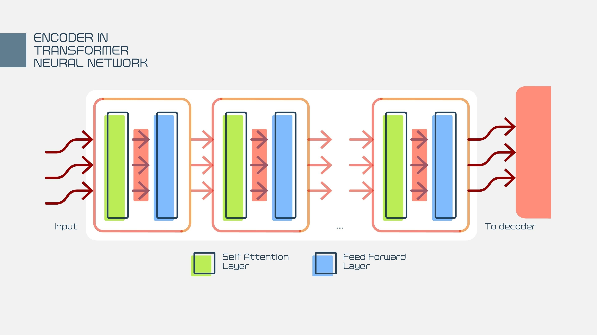
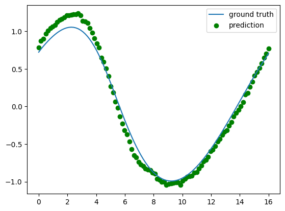
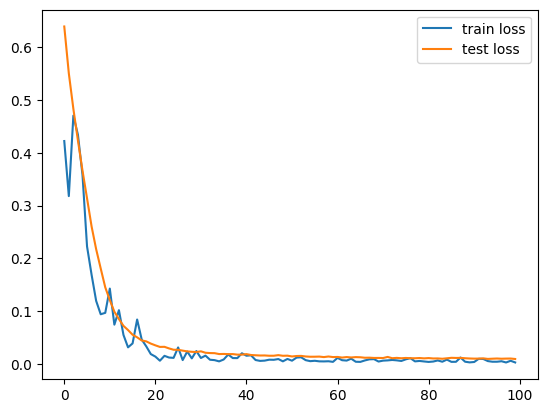

# PDE-GPT-Solving-Physics-with-Transformers

### Context: Scientific Machine Learning (SciML) / AI for Physics

### Architecture: Transformer (GPT-style)

### Goal: Solving Partial Differential Equations (PDEs) using Deep Learning

### Environment: PyTorch (GPU Recommended)

This project takes that exact same concept but applies it to Physics instead of language.

- In Language: The AI reads "The cat sat on the..." -> and predicts "mat".

- In this Project: The AI looks at a sequence of physical measurements (like temperature, fluid speed, or wave height) over time -> and predicts what the physics will do next.



## 🚀 Project Description

This project implements a Transformer-based neural network designed to model and predict the behavior of systems governed by Partial Differential Equations (PDEs).

Key Objectives:

- Data Handling: Loading physical simulation data (likely time-series or spatial grids representing physical fields).

- Transformer Implementation: Building a custom Transformer model in PyTorch. unlike standard NLP models, this likely handles continuous numerical inputs rather than tokenized text.

- Training: optimizing the model to minimize the error between the predicted physical state and the actual ground truth from the PDE.



## 🛠️ Installation & Requirements

This project is built for a Jupyter Notebook environment, specifically Google Colab (as indicated by the drive.mount calls).

Dependencies:
```
Python 3.x
PyTorch
NumPy (for numerical operations)
Matplotlib (for visualizing the physics fields and loss curves)
```
Installation:

```pip install torch numpy matplotlib```

📂 Project Structure
```bash
├── notebooks/
│   └── pde_gpt.ipynb       # Main implementation (Model & Training Loop)
├── data/
│   └── (External Data)     # The notebook expects data from Google Drive
├── outputs/
│   └── loss_curves.png     # Training vs Test loss visualization
└── README.md
```

## ⚙️ Implementation Details

The notebook follows a standard deep learning pipeline:

1. Setup: Importing libraries (torch, torch.nn) and connecting to Google Drive to access datasets.

2. Model Definition: Defining the Transformer architecture. This typically involves:

- Embeddings: Converting raw physics values into high-dimensional vectors.

- Attention Mechanism: Allowing the model to focus on specific parts of the past data to predict the future.

- Feed-Forward Networks: Processing the information.

3. Training Loop:

- Forward pass (Prediction).

- Loss calculation (MSE - Mean Squared Error).

- Backpropagation (Updating weights).

4. Visualization: The final cells plot the Training Loss vs. Test Loss to ensure the model is learning the physics correctly without just memorizing the data (overfitting).


## 📝 Usage

1. Mount Drive: Run the first few cells to connect your Google Drive. Note: You will need to ensure the dataset path in the code matches your specific Drive folder structure.

2. Initialize Model: Run the cell defining the GPT class/functions.

3. Train: Execute the training loop. Watch the loss curves plotted at the end—a downward trend indicates successful learning.